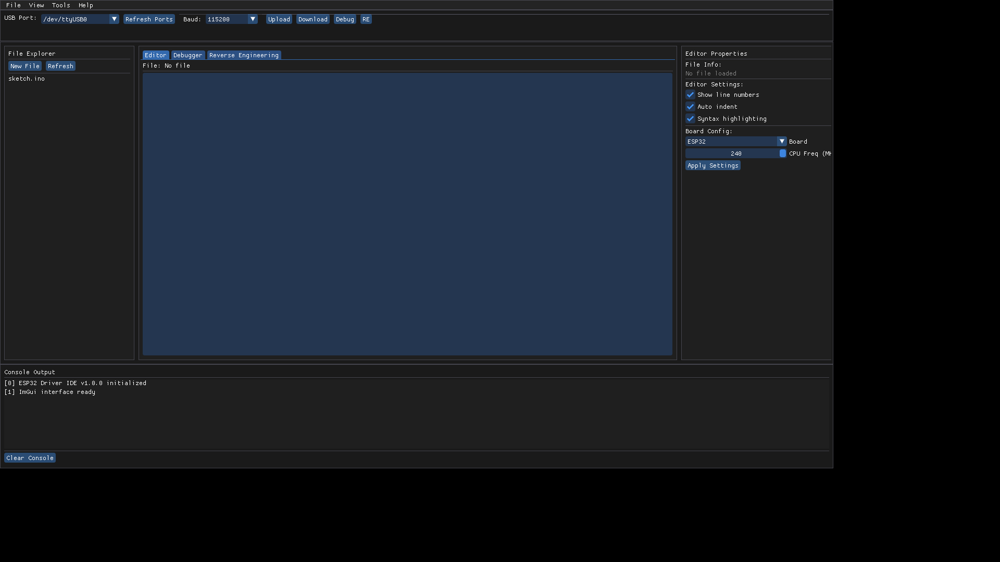
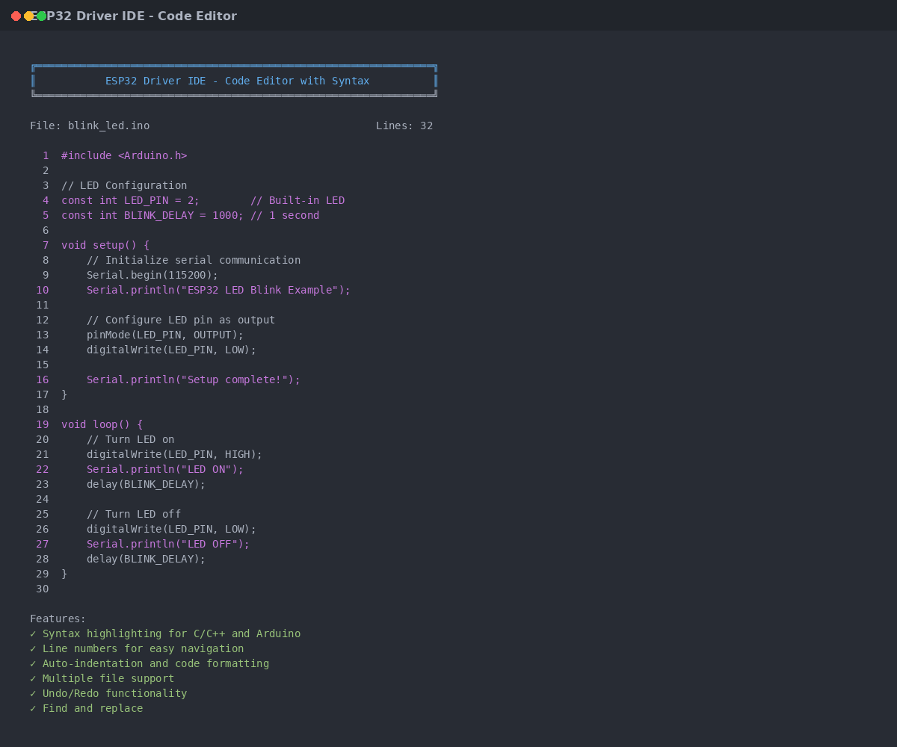
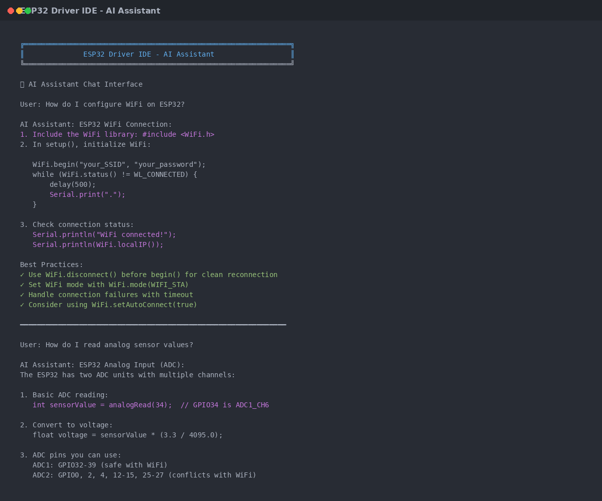
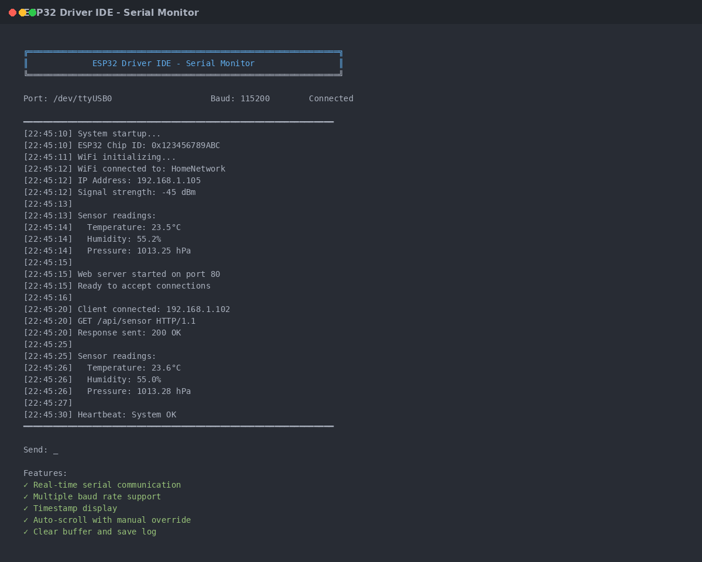
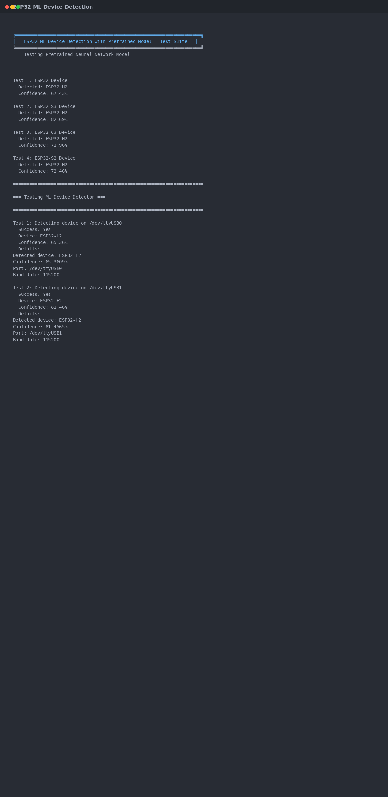
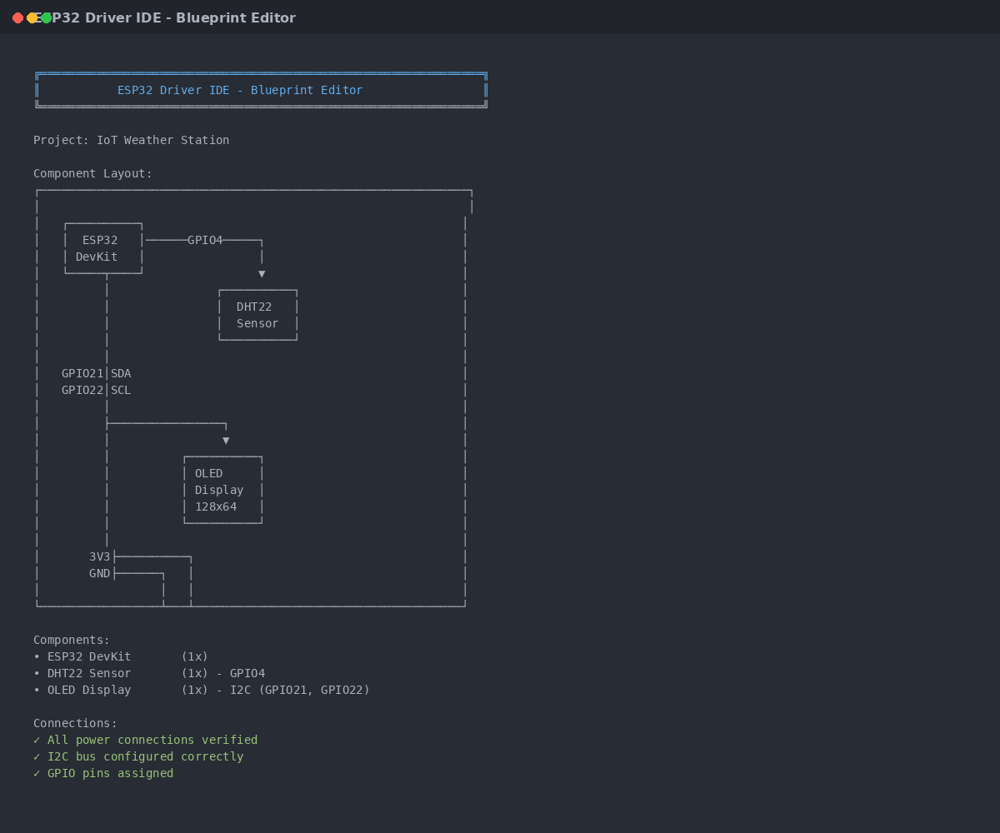
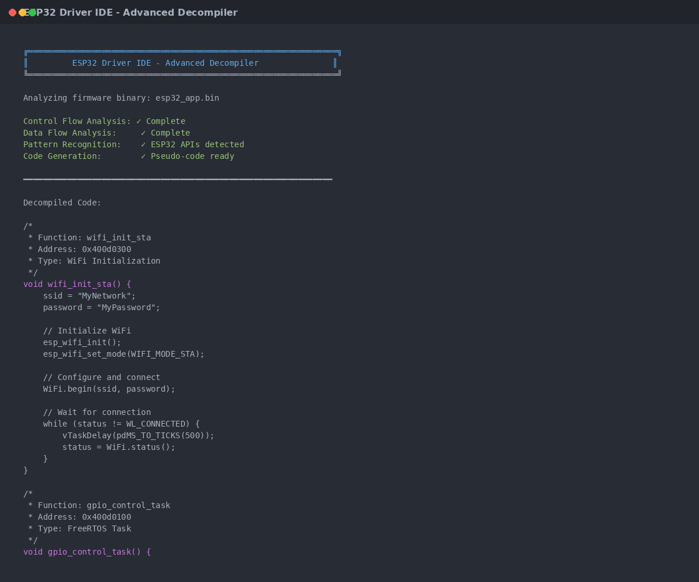
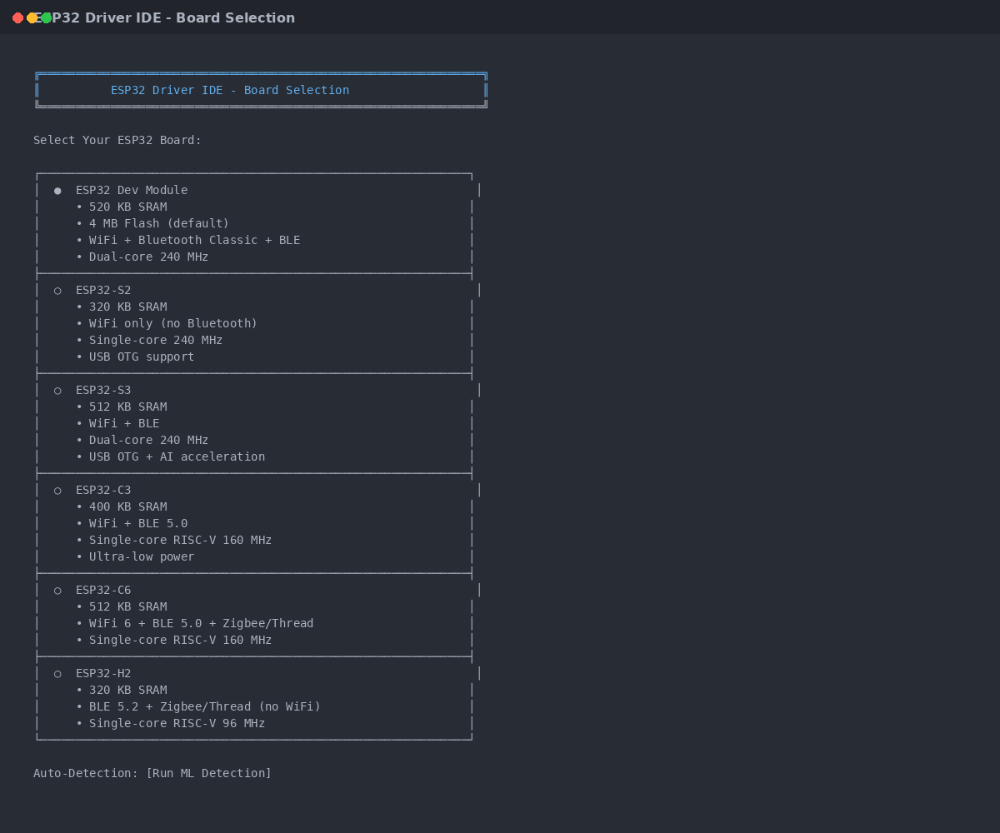
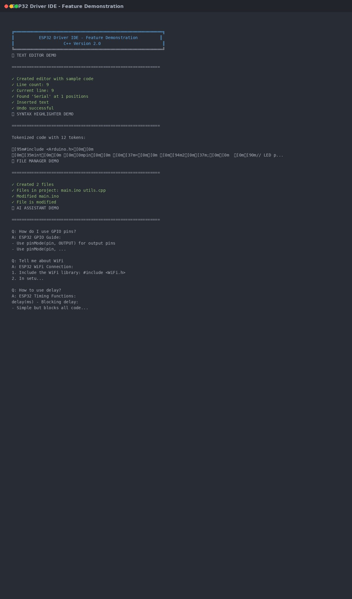
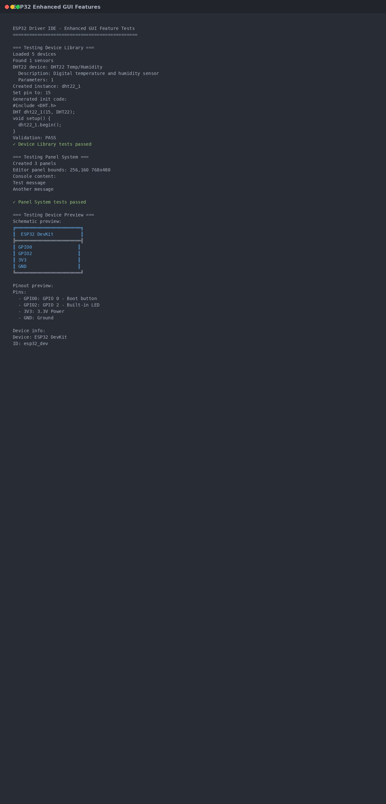

# ESP32 Driver IDE (C++ Version)

A modern, native C++ IDE for ESP32 development with an integrated AI assistant and **professional GUI interface with modular panels**.

<div align="center">



*Professional dark-themed IDE with gradient styling, modular panels, integrated terminal, and device library*

</div>

<div align="center">


*Code editor with file explorer, debugger, and integrated console*

</div>

## 📸 Screenshots

<div align="center">

### Code Editor with Syntax Highlighting


### AI Assistant - Context-Aware Help


### Serial Monitor - Real-Time Communication


### ML Device Detection - Automatic Board Recognition


### Blueprint Editor - Visual Component Layout


### Advanced Decompiler - Firmware Analysis


### Board Selection - Multi-Platform Support


</div>

## ✨ Latest Update: Pure C++ with Enhanced GUI (November 2025)

**🎨 Professional GUI Interface**: Complete implementation with gradient styling, modular panels, and integrated terminal!

**🚀 Lightweight & Fast**: Pure C++ with minimal dependencies - native GUI frameworks only!

**💻 Modular Design**: 
- **Enhanced GUI** (Default): Professional graphical interface with dockable panels, gradient styling, device library, and integrated terminal
- **Simple GUI** (Optional): Lightweight native GUI without external dependencies
- **Terminal Mode** (New): Complete CLI alternative for scripting and headless operation

**📦 Easy Build**: Single command build with no external dependencies to install!

## 🎯 Quick Look at Key Features

### 💡 Feature Demonstrations

<details>
<summary><b>🎨 Complete IDE Demo</b> - See all features in action</summary>



Demonstrates:
- Text editor with syntax highlighting
- File manager with multiple files
- AI assistant queries and code analysis
- ESP32 compiler with error checking
- Serial monitor communication

</details>

<details>
<summary><b>🖥️ Virtual Machine Emulator</b> - Test without hardware</summary>


Features:
- Complete ESP32 device emulation
- GPIO, PWM, and ADC simulation
- WiFi and Bluetooth simulation
- Memory management tracking
- Peripheral configuration testing

</details>

<details>
<summary><b>🎨 Enhanced GUI Features</b> - Professional development environment</summary>



Includes:
- Device library management
- Panel system with docking
- Device preview modes
- Code generation from components
- Schematic visualization

</details>

## Features

### 🎨 Modern User Interface

The IDE features a professional graphical interface with:

- **Gradient Styling**: Beautiful gradient backgrounds and smooth color transitions
- **Modular Panel System**: Dockable panels with resizing and floating support
- **Integrated Terminal**: Built-in terminal for command execution within the IDE
- **Device Library**: Visual device management with preview and configuration
- **Dark Theme**: Professional dark theme optimized for long coding sessions

### ⚡ Key Capabilities

- **AI-Powered Development**: Code generation, refactoring, bug detection, and smart completion
- **Professional Debugging**: Breakpoints, variable watch, memory profiling, and performance analysis
- **ESP32 Device Support**: 8 device variants with ML-based auto-detection
- **Advanced Tools**: Virtual machine emulator, blueprint editor, decompiler, and scripting engine
- **Modern Code Editor**: Syntax highlighting, multiple tabs, file tree, and intelligent autocomplete
- **Backend Framework**: Centralized component management with event-based communication
- **Complete GUI Widgets**: Buttons, dropdowns, sliders, menus, toolbars, and more (Arduino IDE style)
- **Terminal Mode**: Full CLI for scripting and automation

**📖 See [FEATURES.md](FEATURES.md) for complete feature documentation with examples and API reference.**

## Building from Source

### Prerequisites

#### Linux (Ubuntu/Debian)
```bash
sudo apt-get update
sudo apt-get install build-essential cmake g++
```

#### macOS
```bash
# Install Xcode Command Line Tools
xcode-select --install

# Install dependencies
brew install cmake
```

#### Windows
- Visual Studio 2019 or later with C++ tools
- CMake 3.15 or later

### Build Instructions

```bash
# Clone the repository
git clone https://github.com/kamer1337/esp32-driver-ide.git
cd esp32-driver-ide

# Create build directory
mkdir build
cd build

# Configure and build
cmake ..
cmake --build .

# Run the IDE
./esp32-driver-ide  # Linux/macOS
# or
esp32-driver-ide.exe  # Windows
```

### Build Options

```bash
# Build with tests
cmake -DBUILD_TESTS=ON ..
cmake --build .

# Build in Release mode
cmake -DCMAKE_BUILD_TYPE=Release ..
cmake --build .

# Build Terminal Mode executable
cmake -DBUILD_TERMINAL_MODE=ON ..
cmake --build .
# Run with: ./esp32-driver-ide-terminal

# All options
cmake -DBUILD_TESTS=ON -DBUILD_TERMINAL_MODE=ON -DBUILD_WITH_SIMPLE_GUI=ON ..
```

## Terminal Mode (CLI)

For scripting and headless operation, use the Terminal Mode:

```bash
# Interactive mode
./esp32-driver-ide-terminal -i

# Show help
./esp32-driver-ide-terminal --help

# Direct commands
./esp32-driver-ide-terminal boards        # List available boards
./esp32-driver-ide-terminal verify        # Compile current sketch
./esp32-driver-ide-terminal upload        # Upload to board
./esp32-driver-ide-terminal monitor 115200  # Open serial monitor
```

## Architecture

The IDE is built with a modular architecture using modern C++ design patterns:

```
src/
├── main.cpp                    # Entry point
├── backend/                    # Backend framework and event system
├── terminal/                   # Terminal mode CLI application
├── editor/                     # Text editor and syntax highlighting
├── file_manager/              # File operations and templates
├── ai_assistant/              # AI help and code generation
├── compiler/                  # ESP32 compilation and analysis
├── serial/                    # Serial communication and monitoring
├── gui/                       # User interface components and widgets
├── emulator/                  # Virtual machine emulator
├── blueprint/                 # Visual component editor
├── decompiler/                # Firmware analysis
└── utils/                     # Utilities and ML detection
```

**📖 See [FEATURES.md](FEATURES.md) for detailed component documentation.**
## Building from Source

### Prerequisites

#### Linux (Ubuntu/Debian)
```bash
sudo apt-get update
sudo apt-get install build-essential cmake g++
```

#### macOS
```bash
xcode-select --install
brew install cmake
```

#### Windows
- Visual Studio 2019 or later with C++ tools
- CMake 3.15 or later

### Build Instructions

```bash
# Clone the repository
git clone https://github.com/kamer1337/esp32-driver-ide.git
cd esp32-driver-ide

# Create build directory
mkdir build && cd build

# Configure and build
cmake ..
cmake --build .

# Run the IDE
./esp32-driver-ide  # Linux/macOS
# or
esp32-driver-ide.exe  # Windows
```

### Build Options

```bash
# Build with tests
cmake -DBUILD_TESTS=ON ..
cmake --build .

# Build in Release mode (recommended for production)
cmake -DCMAKE_BUILD_TYPE=Release ..
cmake --build .

# Build without Simple GUI (Enhanced GUI only)
cmake -DBUILD_WITH_SIMPLE_GUI=OFF ..
cmake --build .
```

**📖 See [BUILD_GUIDE.md](BUILD_GUIDE.md) for detailed build instructions.**

## Technical Details

- **Language**: C++17
- **Build System**: CMake 3.15+
- **Dependencies**: Zero external dependencies beyond standard C++ library
- **GUI**: Native platform APIs (X11/Win32/Cocoa) or Terminal UI
- **Design**: MVC architecture with modern C++ patterns

## Documentation

- **[FEATURES.md](FEATURES.md)** - Complete feature documentation with examples and API reference
- **[BUILD_GUIDE.md](BUILD_GUIDE.md)** - Detailed build instructions for all platforms
- **[DEVICE_SUPPORT.md](DEVICE_SUPPORT.md)** - ESP32 device specifications and capabilities
- **[ML_DEVICE_DETECTION.md](ML_DEVICE_DETECTION.md)** - ML-based device detection documentation
- **[VM_EMULATOR.md](VM_EMULATOR.md)** - Virtual machine emulator usage guide
- **[DECOMPILER_GUIDE.md](DECOMPILER_GUIDE.md)** - Firmware decompilation examples

## Contributing

Contributions are welcome! Areas for contribution:
- Platform-specific GUI implementations
- Additional ESP32 board support
- Enhanced AI assistant responses
- Real ESP32 toolchain integration
- Serial port communication
- Library management features

## Testing

```bash
# Build with tests enabled
cmake -DBUILD_TESTS=ON ..
cmake --build .

# Run tests
ctest
```

## License

MIT License - feel free to use this project for personal or commercial purposes.

## Acknowledgments

- Inspired by the Arduino IDE and VS Code
- Designed for the ESP32 developer community
- Built with modern C++ best practices
